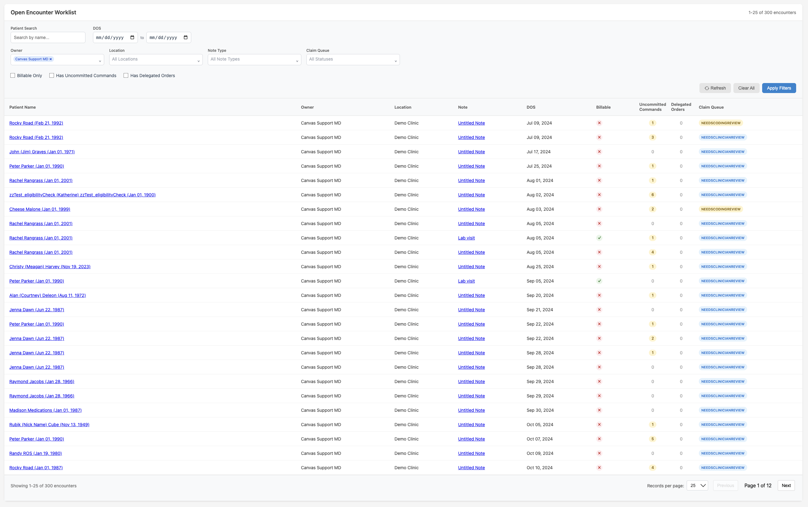

# Notes Worklist Plugin

## Overview

The Notes Worklist plugin provides a filterable worklist view of notes across **open clinical work, finalized notes, and appointments**. Clinicians pick from six clinician-friendly status options (Open / Closed / Booked / No show / Canceled / Deleted) with quick-pick presets for the common cases.

It is a sibling of the [encounter_list](../encounter_list/) plugin, which is hard-scoped to open clinical encounters. Notes Worklist covers a broader scope: it surfaces appointments that haven't happened yet, signed/locked notes, inpatient discharges, and canceled/deleted records that encounter_list deliberately excludes.



## Differs from encounter_list

- **Status multi-select with bucket-level options**: filter by Open, Closed, Booked, No show, Canceled, or Deleted. Quick-pick buttons (All Open / All Closed / All Appointment / All) select common groupings with one click. encounter_list shows the "All Open" set with no way to change it.
- **Per-row Status column**: every row shows the note's current state as a colored badge (green for open, gray for closed, blue for appointment, red for deleted), so mixed-state views stay readable.
- **Location dropdown reacts to Status**: when you change the Status filter, the Location dropdown re-fetches to show only locations that have notes in those states. No more picking a location that has zero matches.
- **Appointments are first-class**: Booked, No show, and Canceled appointments can be surfaced via the "All Appointment" preset — encounter_list hides them entirely.

## Features

- **Status Multi-Select**: Pick from six bucket-level options. Defaults to "All Open" (matches encounter_list's default behavior).
- **Quick-Pick Presets**: One-click buttons for "All Open", "All Closed", "All Appointment", and "All".
- **Status Badge Column**: Each row shows its specific NoteState as a colored badge so you can distinguish, e.g., Signed vs Locked vs Discharged within the Closed bucket at a glance.
- **Contextual Location Dropdown**: Location options stay consistent with the current Status filter.
- **Filtering & Search**: Search by patient name, filter by DOS range, provider (owner), location, note type, claim queue, and uncommitted commands.
- **Per-Dropdown Clear**: Each multi-select dropdown has a Clear button to deselect everything in one click.
- **Multi Selection**: Select multiple providers, locations, note types, and claim queues to view combined workloads.
- **Uncommitted Commands Visibility**: Column and filter for notes with staged/in-review commands that need attention.
- **Claim Queue Visibility**: Column with color-coded badges for billing pipeline status, plus a filter dropdown.
- **Pagination**: Handles large datasets with 25 or 50 records per page.
- **Direct Navigation**: Click-through links to patient charts and encounter notes.

## How to Access

### Installation

Install the plugin using the Canvas CLI:
```bash
canvas install notes_worklist
```

### User Interface Access

The plugin provides one access point:

1. **Global Notes Worklist Application**
   - Scope: Global (available system-wide)
   - Opens a full-page modal showing encounters across the system, filterable by status
   - Accessible from the Canvas main navigation
   - Named "Notes Worklist" in the Canvas interface


## Encounter Types Displayed

### Included Encounter Types
- **Clinical Notes**: All billable and non-billable clinical encounters
- **Visit Notes**: Standard patient visit documentation
- **Procedure Notes**: Documentation of procedures performed
- **Consultation Notes**: Specialist consultations and referrals

### Excluded Encounter Types
- **Messages**: Internal communications between providers
- **Letters**: Formal correspondence and external communications

### Status Filter Options
The Status dropdown bundles related NoteStates into clinician-friendly buckets:

- **Open** (default) — active clinical work: New, Unlocked, Charges pushed, Undeleted, Checked in
- **Closed** — finalized clinical work: Signed, Locked, Discharged
- **Booked** — appointment scheduled, patient not yet checked in
- **No show** — appointment didn't happen
- **Canceled** — appointment was canceled
- **Deleted** — soft-deleted notes (opt-in; not selected by "All" preset)

Rarely-used admin/transient states (Scheduling, Reverted, Confirmed) are not surfaced in the filter UI.

## Filtering Capabilities

### Available Filters & Search

1. **Patient Search**:
   - Free-text search that supports first name, last name, nickname, and common multi-word combinations
   - Press Enter or click Apply Filters to refresh results

2. **Date of Service (DOS) Range**:
   - Start and end date pickers to narrow notes by service date
   - Accepts partial ranges (start only, end only) for flexible filtering

3. **Status**:
   - Multi-select dropdown with bucket-level options (see "Status Filter Options" above)
   - Quick-pick preset buttons: All Open / All Closed / All Appointment / All
   - Defaults to All Open

4. **Owner (Provider)**:
   - Multi-select dropdown of active providers
   - Defaults to showing the logged-in user's notes
   - Per-dropdown Clear button to deselect all

5. **Location**:
   - Multi-select dropdown of practice locations that have notes in the current Status filter
   - Re-fetches automatically when the Status filter changes

6. **Note Type**:
   - Multi-select dropdown of note type names
   - Per-dropdown Clear button

7. **Claim Queue**:
   - Multi-select dropdown of current claim queue statuses
   - Per-dropdown Clear button

8. **Has Uncommitted Commands**:
   - Checkbox to show notes with staged or in-review commands

## Data Columns Displayed

The worklist displays 8 columns:

1. **Patient Name**: Clickable link to patient chart, includes DOB in parentheses
2. **Status**: Colored badge showing the note's specific NoteState (e.g., New, Signed, Booked). Color matches the Status filter bucket: green=open, gray=closed, blue=appointment, red=deleted.
3. **Owner**: Provider responsible for the note (credentialed name)
4. **Location**: Practice location (full name)
5. **Note**: Type and title of the note, clickable link directly to the note
6. **DOS (Date of Service)**: When the encounter is scheduled or took place, formatted as "MMM DD, YYYY"
7. **Uncommitted Commands**: Count of commands staged or in review — helps identify notes with pending actions
8. **Claim Queue**: Current status in the billing/claims process, color-coded badge

## Claim Queue Status Indicators

The plugin displays various claim queue statuses with color-coded badges:

- **Needs Clinician Review**: Blue badge - requires provider review
- **Needs Coding Review**: Yellow badge - requires coding verification  
- **Queued For Submission**: Green badge - ready for insurance submission
- **Filed Awaiting Response**: Light blue badge - submitted to insurance
- **Rejected Needs Review**: Red badge - claim was rejected
- **Adjudicated Open Balance**: Purple badge - processed with balance due
- **Patient Balance**: Orange badge - amount due from patient
- **Zero Balance**: Green badge - fully paid
- **Trash**: Red badge - claim marked for deletion
- **Appointment**: Light blue badge - scheduled appointment

## API Endpoints

The plugin provides several internal API endpoints:

- `/plugin-io/api/notes_worklist/encounters` - Paginated encounter data with filtering
- `/plugin-io/api/notes_worklist/providers` - Active provider list for filters
- `/plugin-io/api/notes_worklist/locations` - Practice locations with encounters

## Pagination

- **Default page size**: 25 encounters per page
- **Navigation controls**: Previous/Next buttons with page indicators
- **Total count display**: Shows current page range and total encounter count
- **Automatic filtering**: Filters reset pagination to page 1

## Technical Implementation

### Database Integration
- Integrates with Canvas ORM models: `Note`, `Command`, `Staff`, `Patient`
- Filters notes by state
- Excludes message and letter categories: `NoteTypeCategories.MESSAGE`, `NoteTypeCategories.LETTER`
- Uses Django annotations for efficient command counting
- Uses django order by for sorting columns

### Frontend Technology
- Vanilla JavaScript (no external frameworks)
- CSS Grid and Flexbox for responsive layouts
- Custom dropdown components for multi-select filtering
- Direct HTML table rendering for performance

### Performance Optimizations
- Server-side pagination to handle large datasets
- Efficient database queries with proper filtering
- Minimal JavaScript dependencies

## Navigation Features

### Direct Links
- **Patient Chart**: Click patient name to open full patient record
- **Encounter Note**: Click note title to open specific encounter


## Responsive Design

The interface adapts to different screen sizes:
- **Desktop**: Full table layout with all columns visible
- **Mobile**: Compressed layout with adjusted padding and font sizes
- **Tablet**: Responsive column widths and flexible pagination controls


### Monitoring

Monitor plugin functionality through Canvas logs:
```bash
canvas logs 
```


